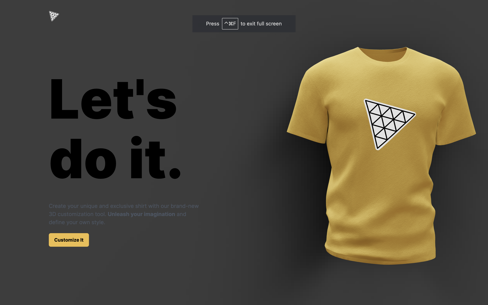
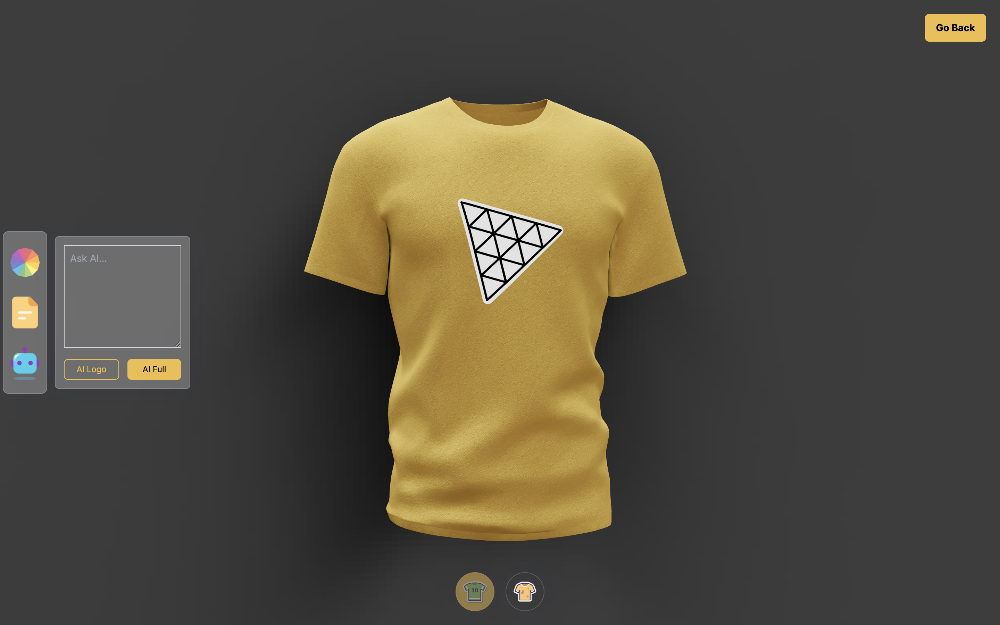

# 3D-Web-App
## JavaScript, React.js, Three.js, TailwindCSS

Full-stack web application
An interactive 3D T-shirt model, allowing users to manipulate and customize the T-shirt's appearance. It's built using a combination of front-end and back-end technologies, with the front-end primarily developed using Three.js and React, and the back-end using Node.js and Express.js.    
Integrated OpenAI's API so users can generate unique logos and shirt designs with custom text.  

